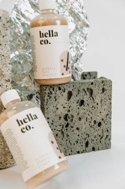
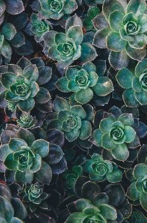
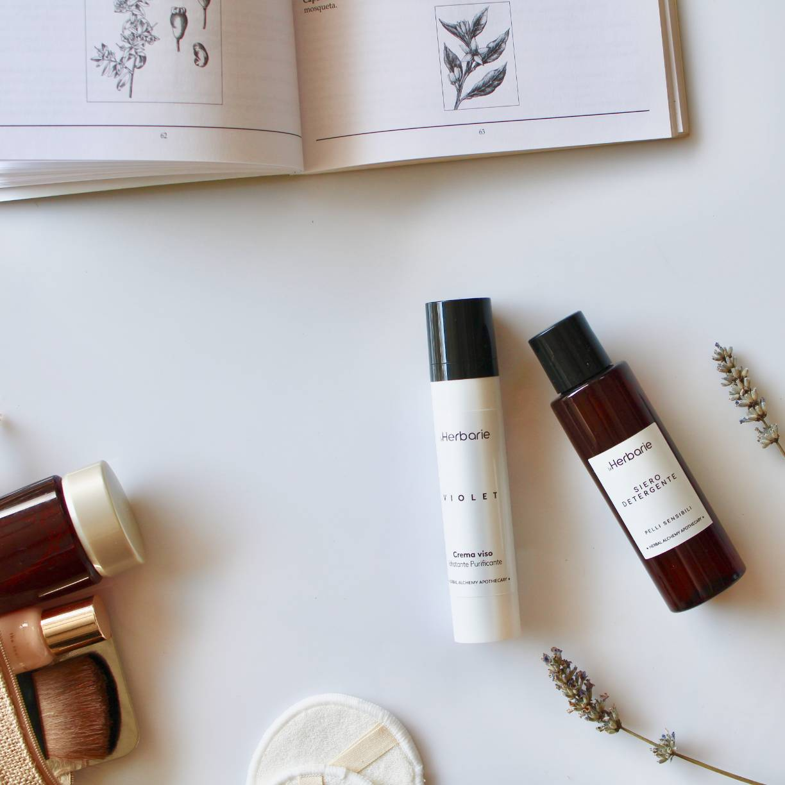
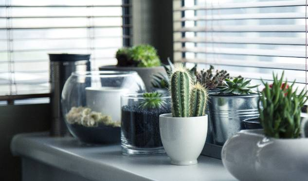
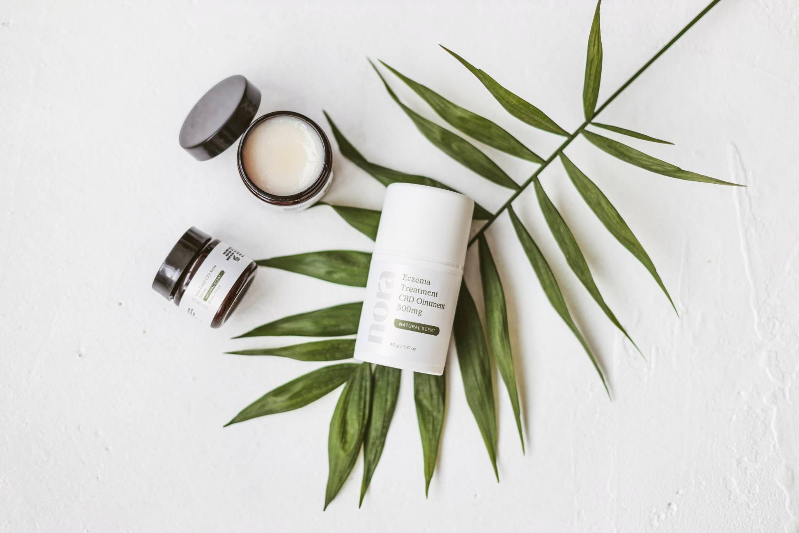

1. 要素を配置、クラスを設定

```html
<main class="container">
  <div class="card__contents">
    <div class="card">
      
      <p>in <span class="bold">Health</span> on 12th Jan 2021</p>
      <h3 class="card__title">
        I am alone, and feel the charm of existence created for the bliss
      </h3>
      <p>
        I am so happy, my dear friend, so absorbed in the exquisite sense of
        mere tranquil existence, that I neglect my talents. I should be
        incapable of drawing
      </p>
      <button>Read more</button>
    </div>
    <div class="card">
      
      <p>in <span class="bold">Love and Relationship</span> on 12th Jan 2021</p>
      <h3 class="card__title">
        I am alone, and feel the charm of existence created for the bliss
      </h3>
      <p>
        I am so happy, my dear friend, so absorbed in the exquisite sense of
        mere tranquil existence, that I neglect my talents. I should be
        incapable of drawing
      </p>
      <button>Read more</button>
    </div>
    <div class="card">
      
      <p>in <span class="bold">Travel Tips</span> on 12th Jan 2021</p>
      <h3 class="card__title">
        I am alone, and feel the charm of existence created for the bliss
      </h3>
      <p>
        I am so happy, my dear friend, so absorbed in the exquisite sense of
        mere tranquil existence, that I neglect my talents. I should be
        incapable of drawing
      </p>
      <button>Read more</button>
    </div>
    <div class="card">
      
      <p>in <span class="bold">Health</span> on 12th Jan 2021</p>
      <h3 class="card__title">
        I am alone, and feel the charm of existence created for the bliss
      </h3>
      <p>
        I am so happy, my dear friend, so absorbed in the exquisite sense of
        mere tranquil existence, that I neglect my talents. I should be
        incapable of drawing
      </p>
      <button>Read more</button>
    </div>
    <div class="card">
      
      <p>in <span class="bold">Love and Relationship</span> on 12th Jan 2021</p>
          <h3 class="card__title">
        I am alone, and feel the charm of existence created for the bliss
      </h3>
      <p>
        I am so happy, my dear friend, so absorbed in the exquisite sense of
        mere tranquil existence, that I neglect my talents. I should be
        incapable of drawing
      </p>
      <button>Read more</button>
    </div>
    <div class="card">
      
      <p>in <span class="bold">Travel Tips</span> on 12th Jan 2021</p>
          <h3 class="card__title">
        I am alone, and feel the charm of existence created for the bliss
      </h3>
      <p>
        I am so happy, my dear friend, so absorbed in the exquisite sense of
        mere tranquil existence, that I neglect my talents. I should be
        incapable of drawing
      </p>
      <button>Read more</button>
    </div>
  </div>
</main>
```

2. メインの横幅を指定と中央に配置

```css
.container {
  width: 1400px;
  margin: 0 auto;
}
```
